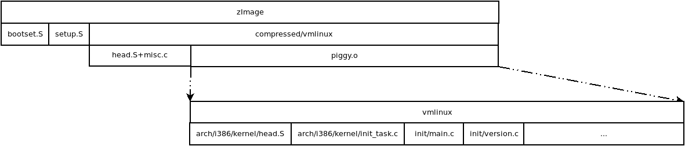

## 前言

想了解内核是如何启动的，首先应该搞清楚内核镜像文件（zImage，bzImage）是如何生成的。

相对于0.11 内核的镜像文件 `Image` ，`zImage` 中 **z** 的意思是压缩，`bzImage` 中 **b** 的意思是大的。

`zImage` 就是压缩的镜像文件；`bzIamge` 就是压缩的大镜像文件。


## 内核编译

将有关镜像生成的`Makefile` 文件内容摘录如下。

### 生成zImage

```makefile
# arch/i386/Makefile
LINKFLAGS =-T $(TOPDIR)/arch/i386/vmlinux.lds $(LDFLAGS)
HEAD := arch/i386/kernel/head.o arch/i386/kernel/init_task.o

# Makefile
vmlinux: $(CONFIGURATION) init/main.o init/version.o linuxsubdirs
        $(LD) $(LINKFLAGS) $(HEAD) init/main.o init/version.o \
                --start-group \
                $(CORE_FILES) \
                $(DRIVERS) \
                $(NETWORKS) \
                $(LIBS) \
                --end-group \
                -o vmlinux
        $(NM) vmlinux | grep -v '\(compiled\)\|\(\.o$$\)\|\( [aUw] \)\|\(\.\.ng$$\)\|\(LASH[RL]DI\)' | sort > System.map

# arch/i386/boot/compressed/Makefile
HEAD = head.o
SYSTEM = $(TOPDIR)/vmlinux
OBJECTS = $(HEAD) misc.o

ZIMAGE_OFFSET = 0x1000		# 4KB
ZLINKFLAGS = -Ttext $(ZIMAGE_OFFSET) $(ZLDFLAGS)

vmlinux: piggy.o $(OBJECTS)
        $(LD) $(ZLINKFLAGS) -o vmlinux $(OBJECTS) piggy.o

piggy.o:        $(SYSTEM)
        tmppiggy=_tmp_$$$$piggy; \
        rm -f $$tmppiggy $$tmppiggy.gz $$tmppiggy.lnk; \
        $(OBJCOPY) $(SYSTEM) $$tmppiggy; \
        gzip -f -9 < $$tmppiggy > $$tmppiggy.gz; \
        echo "SECTIONS { .data : { input_len = .; LONG(input_data_end - input_data) input_data = .; *(.data) input_data_end = .; }}" > $$tmppiggy.lnk; \
        $(LD) -r -o piggy.o -b binary $$tmppiggy.gz -b elf32-i386 -T $$tmppiggy.lnk; \
        rm -f $$tmppiggy $$tmppiggy.gz $$tmppiggy.lnk

# arch/i386/boot/Makefile
zImage: $(CONFIGURE) bootsect setup compressed/vmlinux tools/build
        $(OBJCOPY) compressed/vmlinux compressed/vmlinux.out
        tools/build bootsect setup compressed/vmlinux.out $(ROOT_DEV) > zImage

tools/build: tools/build.c
        $(HOSTCC) $(HOSTCFLAGS) -o $@ $< -I$(TOPDIR)/include

bootsect: bootsect.o
        $(LD) -Ttext 0x0 -s -oformat binary -o $@ $<
bootsect.o: bootsect.s
        $(AS) -o $@ $<
bootsect.s: bootsect.S Makefile $(BOOT_INCL)
        $(CPP) $(CPPFLAGS) -traditional $(SVGA_MODE) $(RAMDISK) $< -o $@

setup: setup.o
        $(LD) -Ttext 0x0 -s -oformat binary -e begtext -o $@ $<
setup.o: setup.s
        $(AS) -o $@ $<
setup.s: setup.S video.S Makefile $(BOOT_INCL) $(TOPDIR)/include/linux/version.h $(TOPDIR)/include/linux/compile.h
        $(CPP) $(CPPFLAGS) -traditional $(SVGA_MODE) $(RAMDISK) $< -o $@
```


* 生成顶层`vmlinux`文件

  通过链接脚本`vmlinux.lds` 生成 vmlinux 文件，打开链接脚本能够发现

  ```
  SECTIONS
  {
  	. = 0xC0000000 + 0x100000;
  	_text = .;
  	/*...*/
  }
  ```

  说明链接生成的代码段虚地址是从 `. = 0xC0000000 + 0x100000;` 开始的，所以执行该部分代码的时候，代码段起始位置的地址必须为

   `. = 0xC0000000 + 0x100000;`

  **注意：此处的地址指的是段内偏移地址，下同。**

* 生成 `arch/i386/boot/compressed/vmlinux` 文件

  * 首先通过压缩，将顶层`vmlinux` 文件生成 `piggy.o` 文件

  * 将`piggy.o` 文件根本目录下的 `head.o`、`misc.o` 文件合成 `arch/i386/boot/compressed/vmlinux` 文件

    ```makefile
    ZIMAGE_OFFSET = 0x1000
    ZLINKFLAGS = -Ttext $(ZIMAGE_OFFSET) $(ZLDFLAGS)
    ```

    此处代码段的起始地址为 `0x1000` 说明该段代码被执行的时候，代码段起始位置地址为 `0x1000`

* 生成`zImage` 文件

  将 `bootsect`、`setup`、`compressed/vmlinux` 文件通过 build 合成 `zImage` 文件


### 生成bzImage

`bzImage` 文件生成根 `zImage` 流程基本相同，有几处地方不一致。

1. 生成 `arch/i386/boot/compressed/vmlinux` 文件时代码段的偏移地址不一致

   ```makefile
   BZIMAGE_OFFSET = 0x100000       # 1MB
   
   BZLINKFLAGS = -Ttext $(BZIMAGE_OFFSET) $(ZLDFLAGS)
   
   bvmlinux: piggy.o $(OBJECTS)
           $(LD) $(BZLINKFLAGS) -o bvmlinux $(OBJECTS) piggy.o
   ```

2. 编译`bootsect.S` ，`setup.S` 文件时，定义了`__BIG_KERNEL__` 宏

   ```makefile
   bsetup: bsetup.o
           $(LD) -Ttext 0x0 -s -oformat binary -e begtext -o $@ $<
   bsetup.o: bsetup.s
           $(AS) -o $@ $<
   bsetup.s: setup.S video.S Makefile $(BOOT_INCL) $(TOPDIR)/include/linux/version.h $(TOPDIR)/include/linux/compile.h
           $(CPP) $(CPPFLAGS) -D__BIG_KERNEL__ -traditional $(SVGA_MODE) $(RAMDISK) $< -o $@
   
   bbootsect: bbootsect.o
           $(LD) -Ttext 0x0 -s -oformat binary $< -o $@
   bbootsect.o: bbootsect.s
           $(AS) -o $@ $<
   bbootsect.s: bootsect.S Makefile $(BOOT_INCL)
           $(CPP) $(CPPFLAGS) -D__BIG_KERNEL__ -traditional $(SVGA_MODE) $(RAMDISK) $< -o $@
   ```

   

## 内核启动




**注意：图中的文件名写的不是很严谨，参照上边的Makefile应该能够看明白具体指的哪个文件。**


内核编译过程中最早生成了`vmlinux` 文件，压缩后形成了`piggy.o`文件， 然后给`piggy.o`文件加了 `head.S` + `misc.c` 编译生成的头部，又在此基础上添加了 `bootset.S` 和 `setup.S` 文件编译生成的头部；在内核启动过程中这些添加的头部会一层层剥掉，类似报文处理。


通过上图能够很明显的看出内核启动的处理流程。

